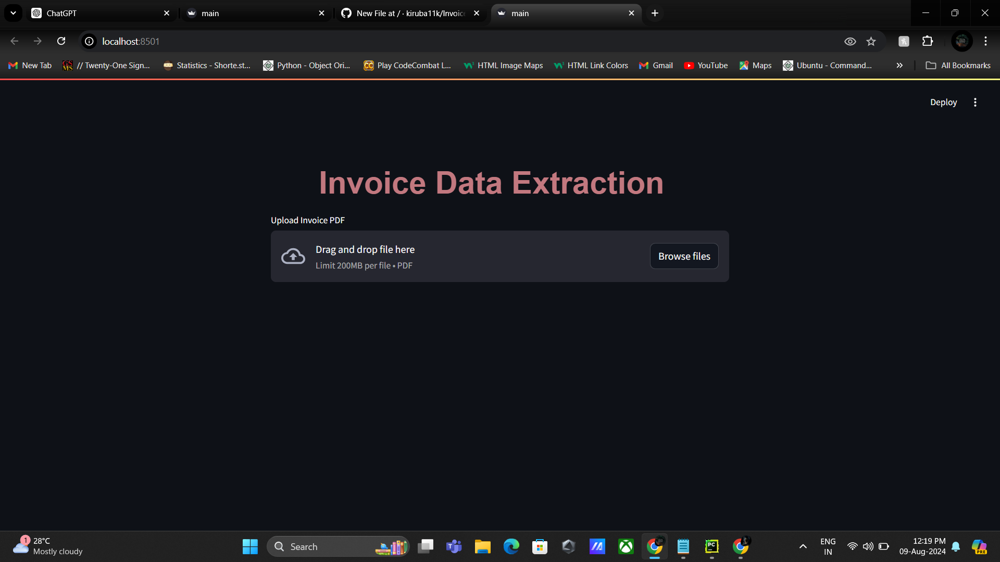
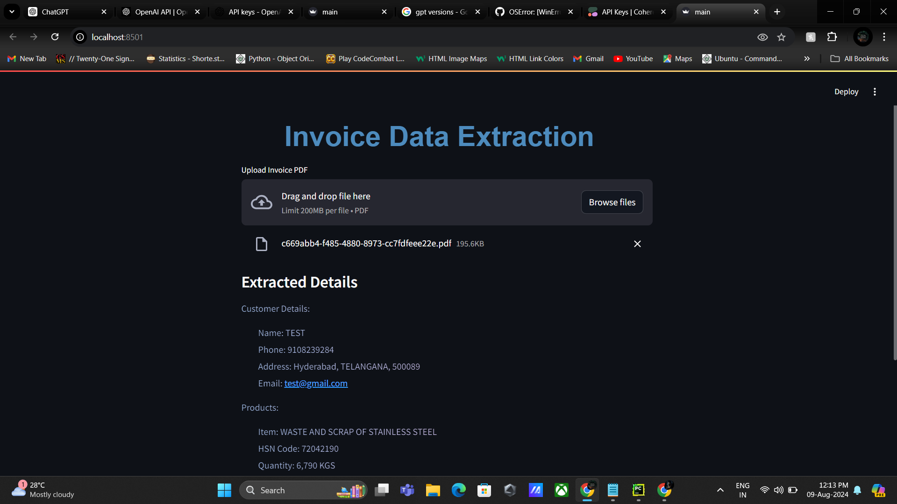
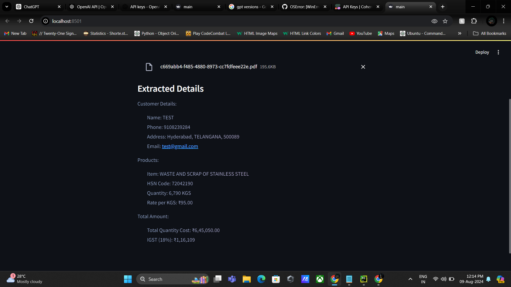

# Invoice Data Extraction AI App 🧾🤖

Meet the Invoice Data Extraction AI App! 🚀 Seamlessly extract and highlight customer details, products, and total amounts from invoices using Streamlit, Cohere AI, and pdfplumber. Transform your invoice processing experience now! 🔥✨

## 📝 Description
The Invoice Data Extraction AI App is a Streamlit-based web application designed to extract key information from invoice PDFs. It allows users to upload an invoice PDF, extract text from it, and utilize Cohere AI to extract customer details, products, and total amounts. The extracted data is displayed in a beautifully structured and highlighted format.

## 📢 Demo App with Streamlit Cloud (Visualize only)

[Launch App On Streamlit](https://invoiceaixtract.streamlit.app/)

## 💻 Demo:

## 🎯 How It Works:
------------

The application follows these steps to extract and highlight details from your invoices:

1. **PDF Loading** : The app reads the uploaded PDF invoice and extracts its text content using pdfplumber.

2. **Text Extraction** : The extracted text is processed by Cohere AI to identify and extract key details like customer information, products listed, and the total amount.

3. **Structured Display** : The extracted information is then structured and highlighted with custom styling to ensure clarity and readability.

--- 
## 🎯 Key Features

- **Customer Details Extraction**: Automatically extracts and displays customer information like name, address, and contact details.
- **Product Details Extraction**: Extracts and lists products, quantities, and prices.
- **Total Amount Calculation**: Automatically identifies and highlights the total amount from the invoice.
- **Interactive UI**: Built with Streamlit for an easy-to-use, responsive interface.
- **Cohere AI Integration**: Leverages Cohere's language model for accurate and efficient data extraction.

## 🌟Requirements

- **Streamlit** : A Python library for building web applications with interactive elements.
- **Cohere** : An API client for interacting with Cohere's natural language processing models.
- **pdfplumber** : A library for extracting text, images, and other content from PDF files.

--- 

## ▶️Installation

Clone the repository:

`git clone https://github.com/kiruba11k/Invoice-Data-Extraction-AI-App.git`

Install the required Python packages:

`pip install -r requirements.txt`

Set up your Cohere API key by creating a `.env` file in the root directory of the project with the following contents:

`COHERE_API_KEY=<your-api-key-here>`

Run the Streamlit app:

`streamlit run app.py`

---

## 💡Usage

To use the Invoice Data Extraction AI App, simply follow these steps:

1. Ensure that you have installed the required dependencies and added the **Cohere API key to the `.env` file** (MUST).
2. Run the `app.py` file using the Streamlit CLI. Execute the following command:
